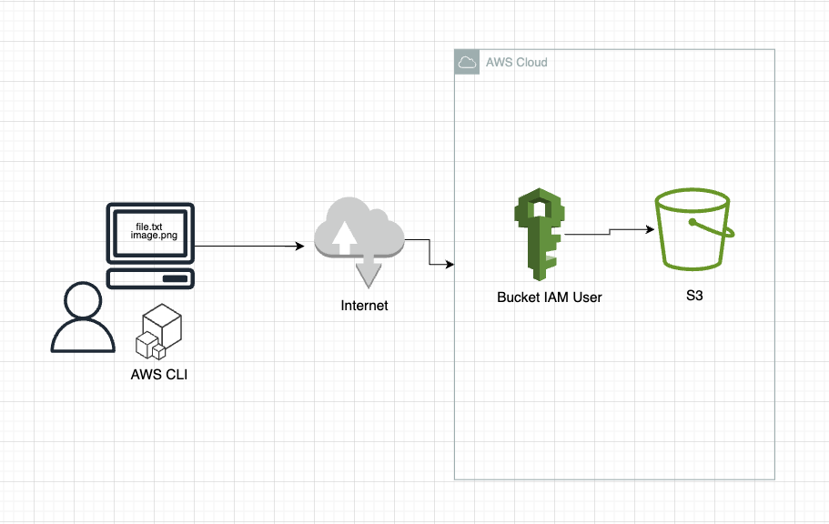

# CloudUploader
This script will take a file and upload it to an AWS S3 bucket that you've created :facepunch:

## Pre-Reqs:
1. Create an S3 bucket in AWS
2. Setup IAM permissions to that bucket
3. Have AWS credentials and configuration file information
3. aws cli package installed on your local machine

## Instructions:
1. Download or copy this repository to your local machine
2. fileUploader is the shell script that will be executed. It takes one parameter: the file you want to push to S3.
3. Remember to specifiy the full file path of that file so the script can find it
4. Run "fileUploader.sh /filepath" and the script will check if the file exists first. If the file exists, it will check your AWS config. If you AWS config is not set, you will be prompted to fill in your Access Key ID, Secret Key ID, Default Region, and Default Output. Feel free to hit enter for Default Output. 
5. If the file doesn't exist or the filepath is wrong, the program will terminate.
6. If upload successful, you will get a success message :white_check_mark:

## Diagram
